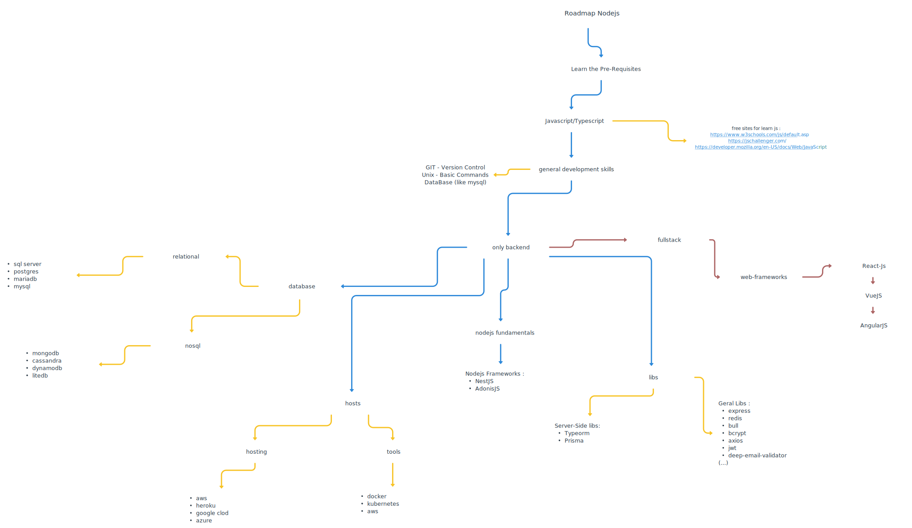

#  Roadmap to becoming a [Node.js](https://nodejs.org/en/) developer in 2023:

Please find below a chart illustrating the pathways and recommended libraries to acquire proficiency as a Node.js developer. I created this chart to assist individuals who often inquire, "Which areas should I focus on to enhance my skills as a Node.js developer?"

## Disclaimer
The purpose of this roadmap is to provide an overview for your journey in Node.js. This is a tool that will assist you in reaching your goals within Node.js more efficiently. However, it's important to remember that this may not always be the best path for everyone, as there are other languages that may suit you better.

## Give a Star! :star:
> If you like or are using this roadmap to learn, please give it a star <3.

## Roadmap

## Books and courses for this:

 

### General:
* [A beginner's guide to HTML&CSS](http://learn.shayhowe.com/html-css/)
* [A free guide to learn HTML and CSS](http://marksheet.io)
* [Adaptive Web Design](http://adaptivewebdesign.info/1st-edition/) - Aaron Gustafson
* [Airbnb CSS / Sass Styleguide](https://github.com/airbnb/css) - Airbnb
* [Airbnb CSS-in-JavaScript Style Guide](https://airbnb.io/javascript/css-in-javascript/) - Airbnb
* [An advanced guide to HTML&CSS](http://learn.shayhowe.com/advanced-html-css/)
* [Atomic Design](https://atomicdesign.bradfrost.com) - Brad Frost
* [Canvassing](https://web.archive.org/web/20160505010319/http://learnjs.io/canvassing/read/)
* [Code Guide: Standards for developing flexible, durable, and sustainable HTML and CSS](http://mdo.github.io/code-guide/) - Mark Otto
* [CSS Animation 101](https://github.com/cssanimation/css-animation-101)
* [CSS Notes for Professionals](http://goalkicker.com/CSSBook) - Compiled from StackOverflow Documentation (PDF)
* [Dive Into HTML5](http://diveinto.html5doctor.com) - Mark Pilgrim ([PDF](http://mislav.net/2011/10/dive-into-html5/))
* [DOM Enlightenment](http://domenlightenment.com) - Cody Lindley (HTML)
* [Essential CSS](https://www.programming-books.io/essential/css/) - Krzysztof Kowalczyk, StackOverflow Contributors
* [Essential HTML](https://www.programming-books.io/essential/html/) - Krzysztof Kowalczyk, StackOverflow Contributors
* [Essential HTML Canvas](https://www.programming-books.io/essential/htmlcanvas/) - Krzysztof Kowalczyk, StackOverflow Contributors
* [GA Dash](https://dash.generalassemb.ly)
* [Google's HTML/CSS Style Guide](https://google.github.io/styleguide/htmlcssguide.html)
* [How To Build a Website with HTML](https://www.digitalocean.com/community/books/how-to-build-a-website-with-html-ebook) - Erin Glass (PDF, EPUB)
* [How to Code in HTML5 and CSS3](https://web.archive.org/web/20180816174417/http://howtocodeinhtml.com/HowToCodeInHTML5AndCSS3.pdf) - Damian Wielgosik (PDF)
* [HTML Canvas Deep Dive](http://joshondesign.com/p/books/canvasdeepdive/toc.html) - Josh Marinacci
* [HTML Dog Tutorials](http://www.htmldog.com)
* [HTML5 Canvas](https://www.oreilly.com/library/view/html5-canvas/9781449308032/ch01.html) - Steve Fulton, Jeff Fulton
* [HTML5 Canvas Notes for Professionals](https://goalkicker.com/HTML5CanvasBook/) - Compiled from StackOverflow documentation (PDF)
* [HTML5 for Publishers](https://www.oreilly.com/library/view/html5-for-publishers/9781449320065/pr02.html) - Sanders Kleinfeld
* [HTML5 For Web Designers](http://html5forwebdesigners.com) - Jeremy Keith
* [HTML5 Notes for Professionals](https://goalkicker.com/HTML5Book/) - Compiled from StackOverflow documentation (PDF)
* [HTML5 Quick Learning Guide](https://www.ossblog.org/wp-content/uploads/2017/06/html5-quick-learning-quide.pdf) - HTML5Templates (PDF)
* [HTML5 Shoot 'em Up in an Afternoon](https://leanpub.com/html5shootemupinanafternoon/read) - Bryan Bibat (HTML)
* [Interneting is Hard (But it Doesn't Have to Be)](https://www.internetingishard.com) - Oliver James
* [Learn CSS Layout](http://learnlayout.com)
* [Learn CSS Layout the pedantic way](http://book.mixu.net/css/)
* [Learn to Code HTML & CSS](https://learn.shayhowe.com) - Shay Howe
* [Learning sass](https://riptutorial.com/Download/sass.pdf) - Compiled from Stack Overflow documentation (PDF)
* [Magic of CSS](https://adamschwartz.co/magic-of-css/) - Adam Schwartz (HTML) (:construction: *in process*)
* [MaintainableCSS](http://maintainablecss.com)
* [Pocket Guide to Writing SVG](https://svgpocketguide.com) - Joni Trythall
* [Practical Series: A website template](https://practicalseries.com/1001-webdevelopment/) - Michael Gledhill (HTML)
* [Pro HTML5 Programming](https://web.archive.org/web/20181215200026/http://apress.jensimmons.com/v5/pro-html5-programming/ch0.html) - Jen Simmons, Chris O'Connor, Dylan Wooters, Peter Lubbers
* [Resilient Web Design](https://resilientwebdesign.com/#Resilientweb%20design) - Jeremy Keith
* [RTL Styling 101](https://rtlstyling.com) - Ahmad Shadeed
* [Scalable and Modular Architecture for CSS](https://web.archive.org/web/20191116073929/http://smacss.com/) - Jonathan Snook
* [The CSS Handbook](https://flaviocopes.com/page/css-handbook/) - Flavio Copes (PDF, EPUB, Kindle) *(email address requested)*
* [The HTML Handbook](https://flaviocopes.com/page/html-handbook/) - Flavio Copes (PDF, EPUB, Kindle) *(email address requested)*
* [Understanding Flexbox: Everything you need to know](https://ohansemmanuel.github.io/uf_download.html) - Ohans Emmanuel
* [W3.CSS Succinctly](https://www.syncfusion.com/ebooks/w3_css_succinctly) - Joseph D. Booth
* [Web Audio API](http://chimera.labs.oreilly.com/books/1234000001552) - Boris Smus
* [Web Visual Effects with CSS3](https://leanpub.com/web-visual-effects-with-css3/read) - Thomas Mak

### Nodejs :
* [An Introduction to libuv](https://nikhilm.github.io/uvbook/) - Nikhil Marathe ([PDF](http://nikhilm.github.io/uvbook/An%20Introduction%20to%20libuv.pdf) - [ePub](http://nikhilm.github.io/uvbook/An%20Introduction%20to%20libuv.epub))
* [Essential Node.js](https://www.programming-books.io/essential/nodejs/) - Krzysztof Kowalczyk, StackOverflow Contributors
* [From Containers to Kubernetes with Node.js](https://www.digitalocean.com/community/books/from-containers-to-kubernetes-with-node-js-ebook) - Kathleen Juell (PDF, EPUB)
* [Full Stack JavaScript: Learn Backbone.js, Node.js and MongoDB](https://github.com/azat-co/fullstack-javascript) - Azat Mardan
* [How To Code in Node.js - eBook](https://www.digitalocean.com/community/books/how-to-code-in-node-js-ebook) - David Landup, Marcus Sanatan @ Stack Abuse, Digital Ocean (PDF, EPUB)
* [Introduction to Node.js](https://nodejs.dev/learn) (HTML)
* [Mastering Node](https://github.com/visionmedia/masteringnode) - visionmedia ([PDF](https://github.com/visionmedia/masteringnode/blob/master/book.pdf))
* [Mixu's Node Book](http://book.mixu.net/node/)
* [Node Documentation](https://nodejs.org/en/docs/) (PDF)
* [Node: Up and Running](https://www.oreilly.com/library/view/node-up-and/9781449332235/) - Tom Hughes-Croucher
* [Node.js Design Patterns](https://ia801309.us.archive.org/5/items/HandbookOfNeuralComputingApplicationsPDFStormRG/Node.js%20Design%20Patterns%20-%20Casciaro,%20Mario%20%5BPDF%5D%5BStormRG%5D.pdf) - Mario Casciaro (PDF)
* [Node.js Notes for Professionals](http://goalkicker.com/NodeJSBook) - Compiled from StackOverflow Documentation (PDF)
* [Node.js Succinctly, Syncfusion](https://www.syncfusion.com/resources/techportal/ebooks/nodejs) (PDF, Kindle) (email address *requested*, not required)
* [Practical Node.js: Building Real-World Scalable Web Apps](https://github.com/azat-co/practicalnode) - Azat Mardan
* [Serverless framework getting started](https://www.serverless.com/framework/docs/getting-started)
* [Shell scripting with Node.js](https://exploringjs.com/nodejs-shell-scripting/index.html) - Axel Rauschmayer (HTML)
* [The Node Beginner Book](http://nodebeginner.org)
* [The Node.js Handbook](https://flaviocopes.com/page/node-handbook/) - Flavio Copes (PDF, EPUB, Kindle) *(email address requested)*

books from : @EbookFoundation

## License

